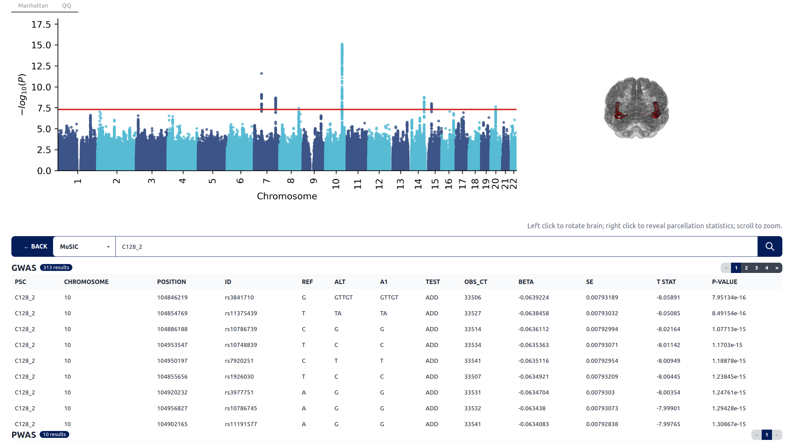

<h1 align="center">
  
   
  BRIDGEPORT
</h1>

<strong>Bridge knowledge from neuroimaging, genetics and clinical phenotypes</strong>

  <a href="https://www.cbica.upenn.edu/bridgeport/">Web portal</a>

# `BRIDGEPORT`
BRIDGEPORT is a publicly accessible web portal that provides massive analytic resources and aims to foster crosstalk for brain imaging genomics.BRIDGEPORT allows you to interactively browse the atlas in a 3D view and explore the phenotypic landscape and genetic architecture of the human brain. You can also download the MUSIC atlas and GWAS summary statistics for your downstream analyses.

## `MUSIC`
MuSIC is a multi-scale brain atlas that parcellates the human brain based on structural covariance patterns using large-scale T1-weighted MRI data over the lifespan. This data-driven atlas encompasses normal brain aging and disease-related effects, endorsing higher statistical power to study the human brain and neuroscience. We provide the download for the MUSIC atlas at multiple scales: C=32, 64, 128, 512, and 1024.

## `GWAS summary statistics`
Many computational genomics methods utilize GWAS summary statistics, instead of the raw genotype data, to perform additional analyses. We store all our GWAS statistics in AWS S3 bucket, allowing users to directly download the data. We list several genomics methods that may leverage our data to future understand the human brain:
<ul>
  <li>Genetic correlation</li>
  <li>Mendelian Randomization</li>
  <li>Gene-based analyses</li>
</ul>

## `BIGS  protocol`
To embrase open science, we made our genetic quality check pipeline publicly available at: [BIGS protocal](https://www.cbica.upenn.edu/bridgeport/data/pdf/BIGS_genetic_protocol.pdf)

## `Browse MUSIC PSC`
Users can browse the results for a specific MUSIC PSC (C128_2):
<h1 align="center">
  
   
</h1>

Alternatively, users can also browse the portal by SNP, gene symbols, clinical traits and MUSE ROI.

## Citing this work
> Junhao, W.E.N., Abdulkadir, A., Satterthwaite, T.D., Robert-Fitzgerald, T., Chen, J., Schnack, H., Zanetti, M., Meisenzahl, E., Busatto, G., Crespo-Facorro, B. and Pantelis, C., 2022. **Novel genomic loci and pathways influence patterns of structural covariance in the human brain**. medRxiv. - [In review](https://www.medrxiv.org/content/10.1101/2022.07.20.22277727v1)

## Publications around
> Wen, J., Fu, C.H., Tosun, D., Veturi, Y., Yang, Z., Abdulkadir, A., Mamourian, E., Srinivasan, D., Skampardoni, I., Singh, A. and Nawani, H., 2022. **Characterizing Heterogeneity in Neuroimaging, Cognition, Clinical Symptoms, and Genetics Among Patients With Late-Life Depression**. JAMA psychiatry, 79(5), pp.464-474. - [Link](https://jamanetwork.com/journals/jamapsychiatry/fullarticle/2789902)

> Wen, J., Yang, Z., Nasrallah, I., Cui, Y., Erus, G., Srinivasan, D., Abdulkadir, A., Mamourian, E., Hwang, G., Singh, A. and Bergman, M., 2022. **Genetic underpinnings of early brain change along two deep-learning Alzheimer's dimensions**. bioRxiv. - [Link](https://www.biorxiv.org/content/10.1101/2022.09.16.508329v1)

> Hwang, G., Wen, J., Sotardi, S., Brodkin, E.S., Chand, G.B., Dwyer, D.B., Erus, G., Doshi, J., Singhal, P., Srinivasan, D. and Varol, E., 2022. **Three Imaging Endophenotypes Characterize Neuroanatomical Heterogeneity of Autism Spectrum Disorder**. medRxiv. - [Link](https://www.medrxiv.org/content/10.1101/2022.06.17.22276543v1)
